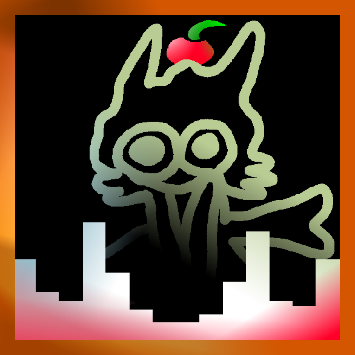

<div align="center">



# sharkfetch

Fastfetch clone in pure Rust — static `musl`, Linux-only

Inspired by <sub>[fastfetch](https://github.com/fastfetch-cli/fastfetch)</sub>

</div>

## Features

- Drop-in `fastfetch` replacement — identical output
- 530 ASCII logos (all `fastfetch` logos)
- Pure Rust, zero crates except `libc`
- Fully static `x86_64-unknown-linux-musl` — `not a dynamic executable`
- Areofetch-like animated logo (`animation = "spin"` in config, `--static` to force static, `q`/`Ctrl-C` to quit)

## Building
```sh
git clone https://github.com/Matko802/sharkfetch.git
cd sharkfetch
make deps
make
sudo make install
```

## Usage

```sh
sharkfetch                 # static (default)
sharkfetch --static        # force static even if config has animation=spin
sharkfetch --list-logos
sharkfetch --help
```

| Option | Description |
| ------ | ----------- |
| `--help` | show help |
| `--static` | force static (no animation) |
| `--list-logos` | show all logos |
| `--list-modules` | list of available modules |

The config file is looked up in `~/.config/sharkfetch/config.toml`, then `~/.config/fastfetch/config.jsonc`. It is auto-created on first run.

Animated like `areofetch` — add to `~/.config/sharkfetch/config.toml`:

```toml
[logo]
name = "nixos"
animation = "spin"  # "spin" to animate, "off"/"static" for static
```

Then `sharkfetch` will animate until you press `q` or `Ctrl-C`; `sharkfetch --static` forces one static frame.

## Any distro with Nix:

```sh
nix develop   # drop into a shell with cargo
make          # build inside the dev shell
```
Or
```sh
nix run github:Matko802/sharkfetch
```

## As a flake input

```nix
{
  inputs = {
    nixpkgs.url = "github:nixos/nixpkgs/nixos-unstable";
    sharkfetch = {
      url = "github:Matko802/sharkfetch";
      inputs.nixpkgs.follows = "nixpkgs";
    };
  };

  outputs = { nixpkgs, sharkfetch, ... }: {
    packages.x86_64-linux.default = sharkfetch.packages.x86_64-linux.default;
  };
}
```

## As an overlay


```nix
{
  inputs = {
    nixpkgs.url = "github:nixos/nixpkgs/nixos-unstable";
    sharkfetch = {
      url = "github:Matko802/sharkfetch";
      inputs.nixpkgs.follows = "nixpkgs";
    };
  };

  outputs =
    { nixpkgs, sharkfetch, ... }:
    let
      system = "x86_64-linux";
    in
    {
      nixosConfigurations.myhost = nixpkgs.lib.nixosSystem {
        inherit system;
        modules = [
          {
            nixpkgs.overlays = [ sharkfetch.overlays.default ];
            environment.systemPackages = [ sharkfetch.packages.${system}.default ];
          }
        ];
      };
    };
}
```

## Standalone build from source

```sh
nix build github:Matko802/sharkfetch
nix run github:Matko802/sharkfetch
```

## Develop

```sh
nix develop github:Matko802/sharkfetch
```

## License

This project is released under the MIT License. See [LICENSE](https://github.com/Matko802/sharkfetch/blob/main/LICENSE).
